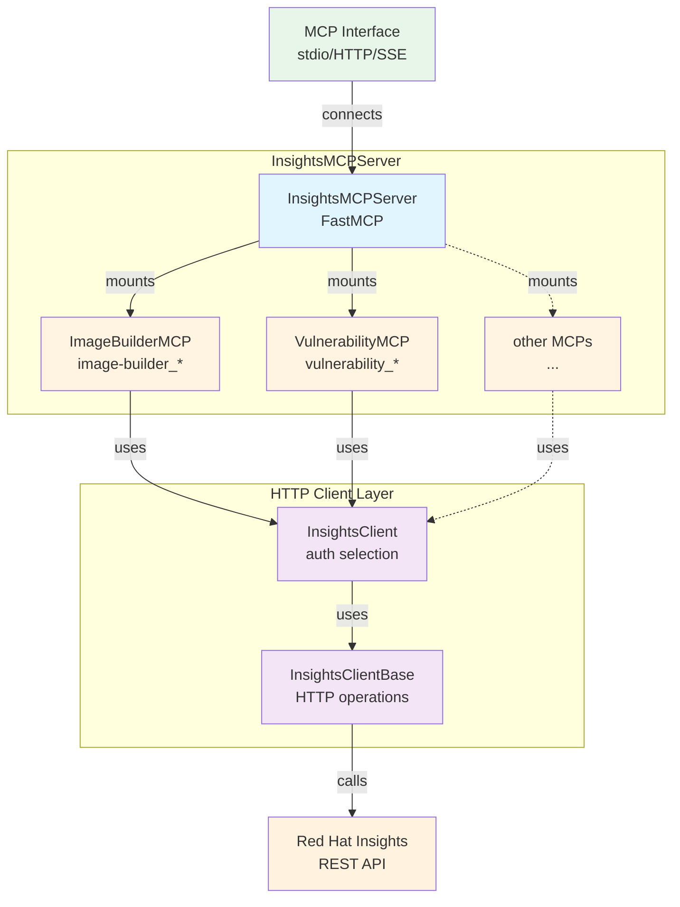
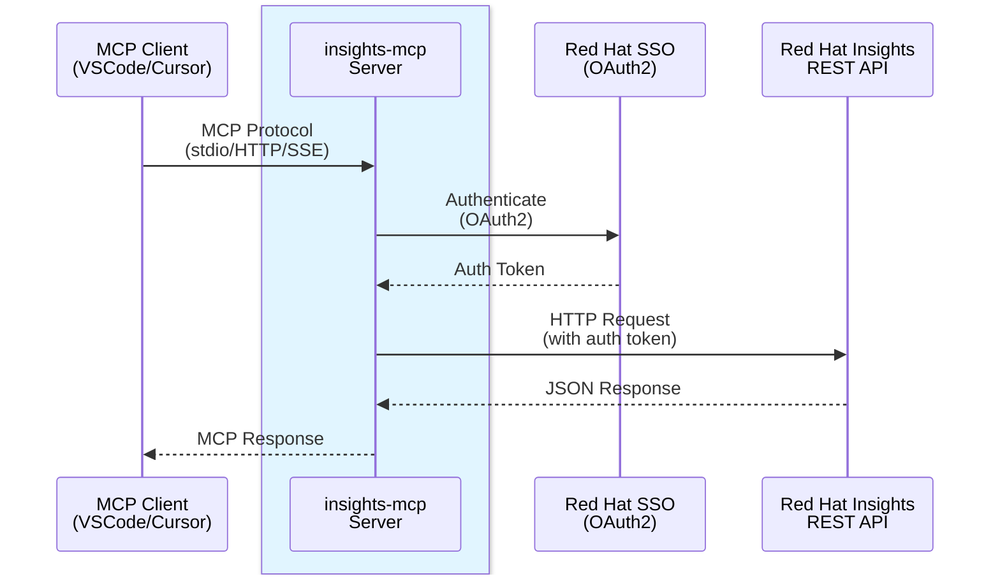

# Insights MCP Contributing Guide

## Run

⚠️ Usually you want to just use the MCP server via a tool like VSCode, Cursor, etc.
so please refer to the [integrations](README.md#integrations) section unless you want to
develop the MCP server.

Also checkout `make help` for the available commands.

## Architecture

### Application Structure

The `InsightsMCPServer` acts as a unified server that mounts multiple specialized MCP toolsets. Each toolset extends `InsightsMCP` and provides tools for specific Red Hat Insights services.



Here is the rendered version: [Application Structure](docs/architecture-structure.svg)

### Deployment Flow

MCP clients (like VSCode or Cursor) communicate with the `insights-mcp` server, which in turn makes authenticated requests to Red Hat Insights REST APIs.



Here is the rendered version: [Deployment Flow](docs/architecture-deployment.svg)

**Note**: To regenerate the `SVG` diagram images, run `make generate-docs`. The diagrams are also rendered directly by GitHub when viewing this file.

## Important notes
* When changing some code you might want to use `make build-prod` so the container is built with
  the upstream container tag and you don't need to change it in your MCP client (like VSCode).

* Make sure you really restart VSCode or Cursor after changing the code, as their "restart" button
  usually doesn't use the newly built container.

* ⚠️ Moreover, when you start VSCode, make sure you hit the `▶️ Start` button of the MCP server,
  **before** you start chatting! Otherwise VSCode _caches_ the tool descriptions and you will
  end up with a chat context with the old tool descriptions!

## Testing/local OpenID Connect (OIDC)

For tests you can override `INSIGHTS_BASE_URL`, `INSIGHTS_SSO_BASE_URL`.


### Usage

See [usage.md](usage.md) for the usage of the MCP server.

### Using Python directly

#### Option 1: Global CLI tool (recommended for usage)
Install as a global CLI tool (lighter, no development dependencies):

```bash
uv tool install -e .
```

Then run directly:

```bash
insights-mcp sse
```

#### Option 2: Project environment (recommended for development)
Set up the development environment (includes development dependencies for testing, linting, etc.):

```bash
uv sync --all-extras --dev
```

Then run with `uv`:

```bash
uv run insights-mcp sse
```

**Note**: Use Option 2 if you need to run tests, linting, or other development tasks:
```bash
uv run pytest
uv run mypy src/
uv run pylint src/
```

Both approaches will start `insights-mcp` server at http://localhost:9000/sse

For HTTP streaming transport:

```bash
insights-mcp http
```

This will start `insights-mcp` server with HTTP streaming transport at http://localhost:8000/mcp

### Using Podman/Docker

You can also copy the command from the [Makefile]
For SSE mode:
```
make run-sse
```

For HTTP streaming mode:
```
make run-http
```

You can also copy the command from the [Makefile]
For stdio mode:
```
make run-stdio
```

### Additional info

You can set the environment variable `IMAGE_BUILDER_MCP_DISABLE_DESCRIPTION_WATERMARK` to `True` to avoid adding a hint to newly created image builder blueprints.


## Hosted MCP Server with DCR Auth (Beta)

The Insights MCP server can be deployed as a hosted service with OAuth authentication, enabling secure multi-user access without requiring users to manage their own service account credentials. This approach uses Dynamic Client Registration (DCR) to allow MCP clients to authenticate through Red Hat Single Sign-On (SSO) with their Red Hat accounts.

DCR support is built on FastMCP's `OIDCProxy`, which acts as a transparent proxy between MCP clients and Red Hat SSO. It presents a DCR-compliant OAuth interface to clients while translating requests to the upstream Red Hat SSO OAuth provider, which doesn't natively support DCR.

### Setup and Run

#### Required SSO Authentication

Before running the server with OAuth enabled, you need to register an OAuth application with Red Hat SSO:

1. **Register OAuth Client Application**:
   - Access Red Hat SSO at `https://sso.redhat.com`
   - Create a new OAuth2/OIDC client application
   - Configure the authorized redirect URI: `http://localhost:8000/oauth/callback` (or your custom host/port)
   - Request the following scopes for your client:
     - `openid` - Standard OIDC identity scope
     - `api.console` - Access to Red Hat Console APIs
     - `api.ocm` - Access to OpenShift Cluster Manager APIs
   - Save the generated `client_id` and `client_secret`

2. **Important Notes**:
   - The server validates that tokens contain ALL required scopes
   - By default, only `localhost:8000` and `127.0.0.1:8000` are authorized host/port combinations
   - To use a different host/port, update `SSO_AUTHORIZED_MCP_SERVER_HOST_PORTS` in `src/insights_mcp/config.py`

#### Required Environment Configuration

Set the following environment variables before starting the server:

```bash
# Enable OAuth authentication mode
export OAUTH_ENABLED=True

# SSO Client credentials (from Red Hat SSO registration)
export SSO_CLIENT_ID="your-sso-client-id"
export SSO_CLIENT_SECRET="your-sso-client-secret"

# Optional: Custom SSO base URL (defaults to https://sso.redhat.com)
export SSO_BASE_URL="https://sso.redhat.com"

# Optional: OAuth timeout in seconds (defaults to 30)
export SSO_OAUTH_TIMEOUT_SECONDS=30
```

**Important**: When `OAUTH_ENABLED=True`, the server uses SSO credentials for the OAuth proxy. The traditional service account credentials (`INSIGHTS_CLIENT_ID`, `INSIGHTS_CLIENT_SECRET`, `INSIGHTS_REFRESH_TOKEN`) are not used in this mode.

#### Commands to Run the Server

**Using Python directly**:

```bash
# HTTP streaming transport
uv run insights-mcp http --host localhost --port 8000
```

**Note**: The server will log a warning if you specify a host/port combination that isn't in the authorized list, and will fall back to `localhost:8000`.

### The Working Logic

#### OAuth Proxy Architecture

The hosted MCP server implements a sophisticated OAuth proxy pattern that bridges the gap between MCP clients (which expect DCR support) and Red Hat SSO (which doesn't support DCR). Here's how it works:

**1. Client Registration (DCR)**:
- MCP clients discover OAuth endpoints via `.well-known/oauth-authorization-server`
- Clients attempt to dynamically register using the DCR endpoint
- The proxy accepts registration requests and returns the shared SSO client credentials
- Client redirect URIs (e.g., `http://localhost:55454/callback`) are validated against configured patterns

**2. Authorization Flow**:
- Client initiates OAuth flow by redirecting user to authorization endpoint
- Proxy creates a transaction mapping client details (PKCE challenge, redirect URI) to the flow
- Proxy redirects to Red Hat SSO using its fixed callback URL
- User authenticates with Red Hat SSO using their Red Hat account
- Red Hat SSO redirects back to proxy's callback with authorization code

**3. Token Exchange**:
- Proxy exchanges upstream authorization code for access/refresh tokens (server-side)
- Proxy generates a new authorization code bound to client's PKCE challenge
- Proxy redirects to client's original dynamic redirect URI with new code
- Client exchanges code with proxy using PKCE verifier
- Proxy returns upstream tokens to client

**4. API Authentication**:
- Client includes access token in requests to MCP server
- FastMCP's OAuth middleware validates token using Red Hat SSO's JWKS
- Proxy forwards validated requests to Insights toolsets
- Toolsets use token to authenticate with Red Hat Insights APIs

**5. Token Refresh**:
- When access tokens expire, clients send refresh requests to proxy
- Proxy forwards refresh requests to Red Hat SSO
- Updated tokens are returned to client

#### OIDCProxy Implementation

The `init_oauth_provider()` function in `src/insights_mcp/oauth.py` creates an `OIDCProxy` instance configured for Red Hat SSO:

```python
auth_provider = OIDCProxy(
    config_url="https://sso.redhat.com/auth/realms/redhat-external/.well-known/openid-configuration",
    client_id=SSO_CLIENT_ID,
    client_secret=SSO_CLIENT_SECRET,
    base_url="http://localhost:8000",
    required_scopes=["openid", "api.console", "api.ocm"],
    timeout_seconds=30
)
```

The proxy maintains minimal state for active OAuth transactions, PKCE challenges, and token mappings using FastMCP's pluggable storage backend. This enables horizontal scaling across multiple server instances.

#### Security Features

- **PKCE enforced end-to-end**: From client to proxy and proxy to upstream
- **Scope validation**: Tokens without required scopes are rejected
- **Redirect URI validation**: Only authorized patterns accepted (prevents open redirects)
- **Token security**: Refresh tokens stored by hash only
- **Single-use codes**: Authorization codes expire after one use
- **Cryptographic randomness**: Transaction IDs use secure random generation


## Pipelines as Code configuration
To start the PipelineRun, add a new comment in a pull-request with content `/ok-to-test`

If a test fails, add a new comment in a pull-request with content `/retest` to re-run the test.

For more detailed information about running a PipelineRun, please refer to Pipelines as Code documentation [Running the PipelineRun](https://pipelinesascode.com/docs/guide/running/)

To customize the proposed PipelineRuns after merge, please refer to [Build Pipeline customization](https://konflux-ci.dev/docs/how-tos/configuring/)

Please follow the block sequence indentation style introduced by the proposed PipelineRuns YAMLs, or keep using consistent indentation level through your customized PipelineRuns. When different levels are mixed, it will be changed to the proposed style.
