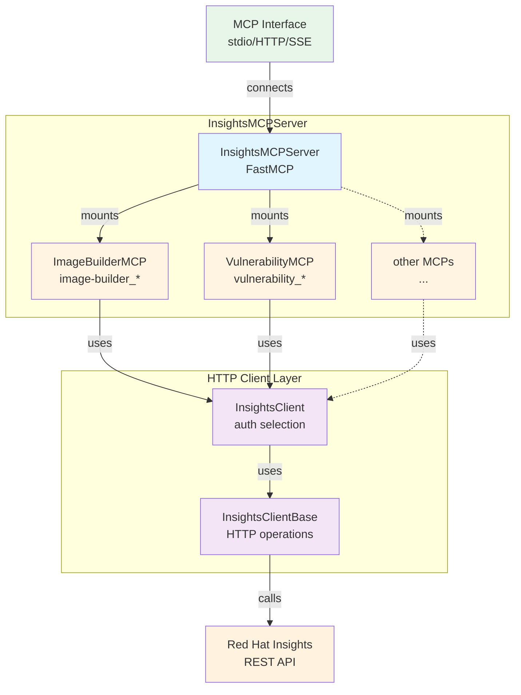
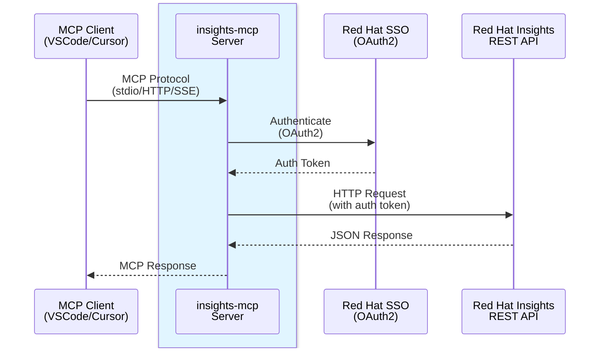

# Insights MCP Contributing Guide

## Run

⚠️ Usually you want to just use the MCP server via a tool like VSCode, Cursor, etc.
so please refer to the [integrations](README.md#integrations) section unless you want to
develop the MCP server.

Also checkout `make help` for the available commands.

## Architecture

### Application Structure

The `InsightsMCPServer` acts as a unified server that mounts multiple specialized MCP toolsets. Each toolset extends `InsightsMCP` and provides tools for specific Red Hat Insights services.



Here is the rendered version: [Application Structure](docs/architecture-structure.svg)

### Deployment Flow

MCP clients (like VSCode or Cursor) communicate with the `insights-mcp` server, which in turn makes authenticated requests to Red Hat Insights REST APIs.



Here is the rendered version: [Deployment Flow](docs/architecture-deployment.svg)

**Note**: To regenerate the `SVG` diagram images, run `make generate-docs`. The diagrams are also rendered directly by GitHub when viewing this file.

## Important notes
* When changing some code you might want to use `make build-prod` so the container is built with
  the upstream container tag and you don't need to change it in your MCP client (like VSCode).

* Make sure you really restart VSCode or Cursor after changing the code, as their "restart" button
  usually doesn't use the newly built container.

* ⚠️ Moreover, when you start VSCode, make sure you hit the `▶️ Start` button of the MCP server,
  **before** you start chatting! Otherwise VSCode _caches_ the tool descriptions and you will
  end up with a chat context with the old tool descriptions!

## Testing/local OpenID Connect (OIDC)

For tests you can override `INSIGHTS_BASE_URL`, `INSIGHTS_TOKEN_ENDPOINT`.


### Usage

See [usage.md](usage.md) for the usage of the MCP server.

### Using Python directly

#### Option 1: Global CLI tool (recommended for usage)
Install as a global CLI tool (lighter, no development dependencies):

```bash
uv tool install -e .
```

Then run directly:

```bash
insights-mcp sse
```

#### Option 2: Project environment (recommended for development)
Set up the development environment (includes development dependencies for testing, linting, etc.):

```bash
uv sync --all-extras --dev
```

Then run with `uv`:

```bash
uv run insights-mcp sse
```

**Note**: Use Option 2 if you need to run tests, linting, or other development tasks:
```bash
uv run pytest
uv run mypy src/
uv run pylint src/
```

Both approaches will start `insights-mcp` server at http://localhost:9000/sse

For HTTP streaming transport:

```bash
insights-mcp http
```

This will start `insights-mcp` server with HTTP streaming transport at http://localhost:8000/mcp

### Using Podman/Docker

You can also copy the command from the [Makefile]
For SSE mode:
```
make run-sse
```

For HTTP streaming mode:
```
make run-http
```

You can also copy the command from the [Makefile]
For stdio mode:
```
make run-stdio
```

### Additional info

You can set the environment variable `IMAGE_BUILDER_MCP_DISABLE_DESCRIPTION_WATERMARK` to `True` to avoid adding a hint to newly created image builder blueprints.
## Pipelines as Code configuration
To start the PipelineRun, add a new comment in a pull-request with content `/ok-to-test`

If a test fails, add a new comment in a pull-request with content `/retest` to re-run the test.

For more detailed information about running a PipelineRun, please refer to Pipelines as Code documentation [Running the PipelineRun](https://pipelinesascode.com/docs/guide/running/)

To customize the proposed PipelineRuns after merge, please refer to [Build Pipeline customization](https://konflux-ci.dev/docs/how-tos/configuring/)

Please follow the block sequence indentation style introduced by the proposed PipelineRuns YAMLs, or keep using consistent indentation level through your customized PipelineRuns. When different levels are mixed, it will be changed to the proposed style.
