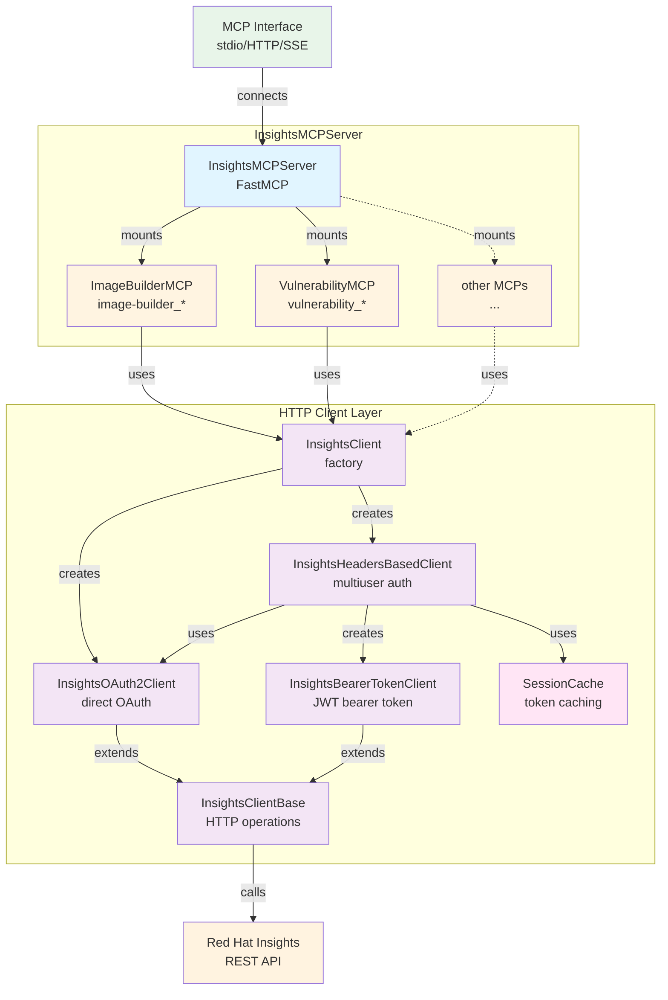
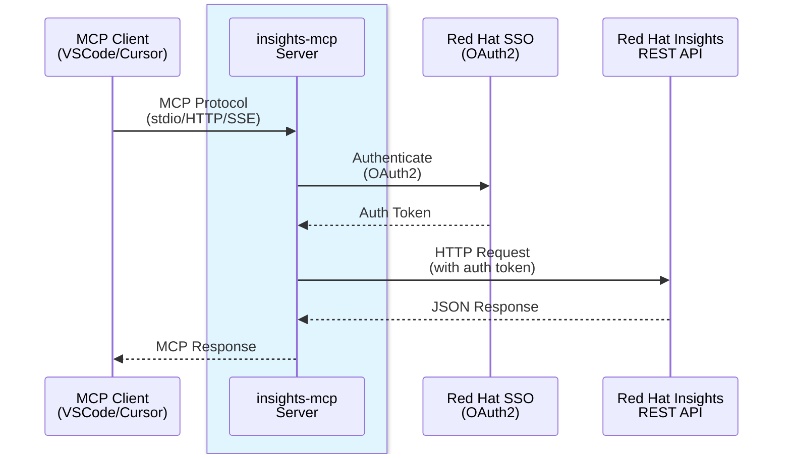

# Insights MCP Contributing Guide

## Run

⚠️ Usually you want to just use the MCP server via a tool like VSCode, Cursor, etc.
so please refer to the [integrations](index.md#integrations) section unless you want to
develop the MCP server.

Also checkout `make help` for the available commands.

## Testing

The majority of tests are automatically run by CI/CD pipelines or
locally by running `make test`.

Although there are tests to use the `main` code, to double check that
especially handing over environment variables and credentials
(in multiple ways) work, those are the use cases that should be working:

### STDIO Mode (see `make run-stdio`)
- Default configuration with credentials in environment variables
- Custom environment: `INSIGHTS_BASE_URL`, `INSIGHTS_PROXY_URL`, and `INSIGHTS_SSO_BASE_URL` set with credentials in environment variables

### Streaming HTTP Mode (see `make run-http`)
- Default configuration with service account credentials in header (`insights-client-id` / `insights-client-secret`)
- Default configuration with JWT Bearer token in `Authorization: Bearer <token>` header
- Custom environment: `INSIGHTS_BASE_URL`, `INSIGHTS_PROXY_URL`, and `INSIGHTS_SSO_BASE_URL` set with credentials in header

### SSE HTTP Mode (deprecated but some MCP clients still need this, see `make run-sse`)
- Default configuration with service account credentials in header or JWT Bearer token
- Custom environment: `INSIGHTS_BASE_URL` and `INSIGHTS_SSO_BASE_URL` set with credentials in header

## Architecture

### Application Structure

The `InsightsMCPServer` acts as a unified server that mounts multiple specialized MCP toolsets. Each toolset extends `InsightsMCP` and provides tools for specific Red Hat Insights services.



Here is the rendered version: [Application Structure](architecture-structure.svg)

### Deployment Flow

MCP clients (like VSCode or Cursor) communicate with the `insights-mcp` server, which in turn makes authenticated requests to Red Hat Insights REST APIs.



Here is the rendered version: [Deployment Flow](architecture-deployment.svg)

**Note**: To regenerate the `SVG` diagram images, run `make generate-docs`. The diagrams are also rendered directly by GitHub when viewing this file.

### Session Cache and Token Management

For multiuser scenarios (SSE/HTTP transports with header-based authentication), the `SessionCache` component provides per-connection OAuth token caching to improve performance and reduce authentication overhead.

**Key features:**
- Cache key: `(session_id, credentials_hash)` ensures isolation between connections and credential sets
- Default TTL: 15 minutes with automatic expiration
- Periodic cleanup: Removes expired entries every 20 minutes
- Thread-safe: Supports concurrent access from multiple requests

**Implementation:** See [`src/insights_mcp/session_cache.py`](https://github.com/RedHatInsights/insights-mcp/blob/main/src/insights_mcp/session_cache.py)

**Used by:** `InsightsHeadersBasedClient` for SSE/HTTP transports when service account credentials are provided via request headers. JWT Bearer token authentication bypasses the cache since no token exchange is needed.

## MCP Apps

[MCP Apps](https://modelcontextprotocol.io/extensions/apps/overview) is an MCP extension (`io.modelcontextprotocol/ui`) that lets MCP servers return interactive HTML interfaces (data visualizations, forms, dashboards) that render directly in the chat. Clients with MCP Apps support include Cursor, VS Code Copilot, Claude Desktop, and [others](https://modelcontextprotocol.io/extensions/client-matrix). CLI and TUI clients (e.g. Claude Code, Copilot CLI, OpenCode) do not support UI rendering.

### How It Works

1. The server registers an HTML page as a **UI resource** (`@mcp.resource`).
2. The server registers a **tool that references it** (`@mcp.tool` with `AppConfig`).
3. When a client calls the tool, the server returns a `ToolResult` with `content` and `structured_content`. To handle clients that don't support UI rendering, the server can use `ctx.client_supports_extension(UI_EXTENSION_ID)` to detect support and adapt the response accordingly.
4. The app HTML connects to the MCP Apps SDK and can interact with the server in two ways:
   - Via `ontoolresult` — receives the tool call result.
   - Via `callServerTool` — invokes MCP tools directly from the HTML (e.g. to fetch additional data or drill into details).

### Adding a New MCP App

#### 1. Create the HTML file

Create `src/<toolset_mcp>/<app_name>.html`.

#### 2. Load the HTML at module level

In `src/<toolset_mcp>/server.py`:

```python
from importlib import resources
from pathlib import Path

def _load_my_app_html() -> str:
    try:
        return resources.files("my_toolset_mcp").joinpath("my_app.html").read_text(encoding="utf-8")
    except (FileNotFoundError, ModuleNotFoundError, AttributeError, TypeError):
        return (Path(__file__).parent / "my_app.html").read_text(encoding="utf-8")

EMBEDDED_MY_APP_HTML = _load_my_app_html()
```

#### 3. Define resource and mounted URIs

```python
MY_APP_RESOURCE_URI = "ui://my-app"
MY_APP_MOUNTED_URI = "ui://my_toolset_/my-app"
```

The mounted URI follows the convention `ui://<toolset_name>_/<app-name>`, matching how FastMCP mounts toolset tools.

#### 4. Register the resource

```python
from fastmcp.apps import AppConfig, ResourceCSP

@mcp.resource(
    MY_APP_RESOURCE_URI,
    app=AppConfig(csp=ResourceCSP(resource_domains=["https://unpkg.com"])),
)
def my_app_ui() -> str:
    """My App UI description."""
    return EMBEDDED_MY_APP_HTML
```

Since the HTML is embedded in the Python package, external dependencies like PatternFly CSS should be loaded from a CDN rather than bundled inline. The `ResourceCSP` whitelist must include any CDN domains used.

#### 5. Register the tool with a UI resource

```python
from fastmcp import Context
from fastmcp.apps import UI_EXTENSION_ID, AppConfig
from fastmcp.tools import ToolResult

@mcp.tool(
    annotations={"readOnlyHint": True},
    app=AppConfig(resource_uri=MY_APP_MOUNTED_URI),
)
async def load_my_app(ctx: Context, ...) -> ToolResult:
    """Render data in the interactive app."""
    ui_supported = ctx.client_supports_extension(UI_EXTENSION_ID)
    if not ui_supported:
        return ToolResult(
            content="Client does not support MCP Apps.",  # fallback instructions for non-UI clients
        )
    return ToolResult(
        content="...",  # optional message for the model (also available for the HTML via result.content)
        structured_content={...},  # data for the HTML via result.structuredContent
    )
```


#### 6. Connect the HTML to MCP Apps SDK

> **Dark mode:** Use CSS variables on `:root` (light) and `[data-theme="dark"]` (dark), toggled by the `onhostcontextchanged` callback. Use `background: transparent` on body to inherit the host app's background.

```html
<link rel="stylesheet" href="https://unpkg.com/@patternfly/patternfly@5.4.2/patternfly.min.css">

<script type="module">
    import("https://unpkg.com/@modelcontextprotocol/ext-apps@0.4.0/app-with-deps").then(module => {
        const App = module.App || module.default?.App || module.default;
        const app = new (App.App || App)({ name: "My App", version: "1.0.0" });
        app.connect();
        window.mcpApp = app;

        app.onhostcontextchanged = (ctx) => {
            const theme = ctx?.theme || "light";
            document.documentElement.setAttribute("data-theme", theme === "dark" ? "dark" : "light");
        };

        app.ontoolresult = (result) => {
            const data = result.structuredContent;  // structured_content from the ToolResult
            const content = result.content;             // content from the ToolResult
            // render data
        };
    });
</script>
```

#### 7. Calling tools from the app

Apps can invoke MCP tools directly for drill-downs or fetching additional data. Only tools on the same MCP server as the resource can be called — cross-server tool calls are not supported.

```javascript
const result = await window.mcpApp.callServerTool({
    name: "toolset__tool_name",
    arguments: { param: "value" }
});
const text = result.content?.find(c => c.type === "text")?.text;
```

#### 8. Add test prompts

Add 1-2 example prompts to `src/<toolset_mcp>/test_prompts.md` that exercise the app.

### Design Resources

- [PatternFly](https://www.patternfly.org/) — CSS framework used for styling MCP Apps in this project

### Existing Apps

Use these as reference implementations:

- **CVE Dashboard**: [`src/vulnerability_mcp/cve_dashboard.html`](https://github.com/RedHatInsights/insights-mcp/blob/main/src/vulnerability_mcp/cve_dashboard.html) + [`server.py`](https://github.com/RedHatInsights/insights-mcp/blob/main/src/vulnerability_mcp/server.py)
- **Inventory Dashboard**: [`src/inventory_mcp/inventory_dashboard.html`](https://github.com/RedHatInsights/insights-mcp/blob/main/src/inventory_mcp/inventory_dashboard.html) + [`server.py`](https://github.com/RedHatInsights/insights-mcp/blob/main/src/inventory_mcp/server.py)

## Important notes
* When changing some code you might want to use `make build-prod` so the container is built with
  the upstream container tag and you don't need to change it in your MCP client (like VSCode).

* Make sure you really restart VSCode or Cursor after changing the code, as their "restart" button
  usually doesn't use the newly built container.

* ⚠️ Moreover, when you start VSCode, make sure you hit the `▶️ Start` button of the MCP server,
  **before** you start chatting! Otherwise VSCode _caches_ the tool descriptions and you will
  end up with a chat context with the old tool descriptions!

## Testing/local OpenID Connect (OIDC)

For tests you can override `INSIGHTS_BASE_URL`, `INSIGHTS_SSO_BASE_URL`.


### Usage

See [usage.md](usage.md) for the usage of the MCP server.

### Using Python directly

#### Option 1: Global CLI tool (recommended for usage)
Install as a global CLI tool (lighter, no development dependencies):

```bash
uv tool install -e .
```

Then run directly:

```bash
insights-mcp sse
```

#### Option 2: Project environment (recommended for development)
Set up the development environment (includes development dependencies for testing, linting, etc.):

```bash
uv sync --locked --all-extras --dev
```

Then run with `uv`:

```bash
uv run insights-mcp sse
```

**Note**: Use Option 2 if you need to run tests, linting, or other development tasks:
```bash
uv run pytest
uv run mypy src/
uv run pylint src/
```

Both approaches will start `insights-mcp` server at http://localhost:9000/sse

For HTTP streaming transport:

```bash
insights-mcp http
```

This will start `insights-mcp` server with HTTP streaming transport at http://localhost:8000/mcp

### Using Podman/Docker

You can also copy the command from the [Makefile]
For SSE mode:
```
make run-sse
```

For HTTP streaming mode:
```
make run-http
```

You can also copy the command from the [Makefile]
For stdio mode:
```
make run-stdio
```

### Additional info

You can set the environment variable `IMAGE_BUILDER_MCP_DISABLE_DESCRIPTION_WATERMARK` to `True` to avoid adding a hint to newly created image builder blueprints.


## Hosted MCP Server with Auth Provider (HTTP transport)

When deploying the MCP server as a hosted service over HTTP/SSE, token validation is handled by
[`mcp_rh_auth`](https://github.com/RedHatInsights/insights-mcp/blob/main/src/mcp_rh_auth/README.md) via `build_auth_provider()`.
When `AUTH_SERVER` is unset, no auth provider is configured and the server falls back to raw
Bearer token pass-through (backward-compatible with self-hosted and stdio deployments).

### Environment Variables

| Variable | Required | Description |
|---|---|---|
| `AUTH_SERVER` | Yes | OAuth authorization server base URL (e.g. `https://sso.redhat.com/auth/realms/redhat-external`) |
| `AUTH_ISSUER` | Yes | JWT `iss` claim — must match the SSO realm issuer |
| `MCP_BASE_URL` | No | Public base URL of this MCP server (used in `/.well-known/oauth-protected-resource`); defaults to `http://localhost:8080` |
| `AUTH_RESOURCE` | No | MCP server resource URL; defaults to `{MCP_BASE_URL}/mcp` if unset |
| `AUTH_SCOPES` | No | Comma-separated required scopes (default: `api.graphql`) |
| `AUTH_AUDIENCE` | No | Comma-separated accepted JWT audiences |
| `AUTH_JWKS_URI` | No | Override JWKS endpoint (otherwise fetched from `AUTH_SERVER` discovery document) |

### How it works

1. `build_auth_provider()` fetches the OIDC discovery document from `AUTH_SERVER` to resolve the JWKS URI and issuer.
2. FastMCP validates the `Authorization: Bearer <token>` header on every HTTP request against the JWKS.
3. The validated token is retrieved via `get_access_token()` and forwarded to the Insights API.
4. If `AUTH_SERVER` is unset, the token is extracted directly from the `Authorization` header without server-side validation (existing behavior).

### Example configuration

```bash
export AUTH_SERVER="https://sso.redhat.com/auth/realms/redhat-external"
export AUTH_ISSUER="https://sso.redhat.com/auth/realms/redhat-external"
export AUTH_SCOPES="openid,api.console,api.ocm"
# For production: set MCP_BASE_URL to the public URL of this server
# export MCP_BASE_URL="https://your-mcp-server.example.com"

uv run insights-mcp http --host 0.0.0.0 --port 8000
```

## Logging and Compliance

### Debug Mode

Debug logging (`--debug` or `INSIGHTS_MCP_DEBUG=1`) includes identifiers such as client IDs and request metadata for troubleshooting. **Do not enable debug mode in production.** Debug logs may be retained by log aggregation systems; restricting debug to development and staging supports ISO 27001 (A.5.17, A.8.11) and ISO 27018 (PII protection).

### Logging and Monitoring

- **Default (INFO)**: Auth events, errors, and request metadata. Client secrets and PII in SSO claims are masked.
- **Debug**: Additional identifiers (client IDs, scopes, org_id). PII (account_id, username, email) remains masked.
- **Retention**: Operators should configure log aggregation and retention per their policy (ISO 27001 A.8.16).

### Deployment Responsibilities

For cloud deployments, the shared responsibility model applies (ISO 27017):

- **Red Hat**: API security, availability, authentication.
- **Operator**: MCP server deployment, credential protection, network isolation, incident response (see [README Security & Incident Response](index.md#security-incident-response-emergency-revocation)).

### AI Governance Scope

The MCP server is an AI-enabling component (connects LLMs to Red Hat services). Operators using it for AI workflows should include it in their AI governance scope (e.g., ISO 42001 AIMS) and risk assessments.


## Pipelines as Code configuration
To start the PipelineRun, add a new comment in a pull-request with content `/ok-to-test`

If a test fails, add a new comment in a pull-request with content `/retest` to re-run the test.

For more detailed information about running a PipelineRun, please refer to Pipelines as Code documentation [Running the PipelineRun](https://pipelinesascode.com/docs/guide/running/)

To customize the proposed PipelineRuns after merge, please refer to [Build Pipeline customization](https://konflux-ci.dev/docs/building/customizing-the-build/)

Please follow the block sequence indentation style introduced by the proposed PipelineRuns YAMLs, or keep using consistent indentation level through your customized PipelineRuns. When different levels are mixed, it will be changed to the proposed style.
